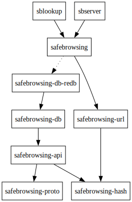

# Safe Browsing API Client for Rust

<!--[](https://github.com/your-org/safebrowsing-rs/actions)-->
[](https://crates.io/crates/safebrowsing)
[](https://docs.rs/safebrowsing)
[](https://matrix.to/#/#safebrowsing-rs:ellis.link?via=ellis.link&via=maunium.net) [](https://discord.gg/zABqAq9apx)


A Rust implementation of the [Google Safe Browsing Update API (v4)](https://developers.google.com/safe-browsing/v4/). This library allows you to check URLs against Google's safebrowsing URL database using the privacy-preserving lookup API v4.

> [!warning]
> This library is currently mostly AI generated as an experiment. It is functional and passes testing, but has known performance issues and the code is not of an exceptional standard.
>
> This may be improved in future to power a production service, but is not there yet. If you find this a useful starting point, please feel free to contribute your changes.


## Architecture




### Core Library Crates
- `safebrowsing`: Main facade crate
- `safebrowsing-api`: Client for communicating with Google's servers (using protobuf)
- `safebrowsing-hash`: Rice-Golomb decoding, Efficient hash prefix storage and lookup
- `safebrowsing-url`: URL canonicalisation and pattern generation
- `safebrowsing-proto`: Protocol buffer definitions for API communications (prost)
- `safebrowsing-db`: Pluggable storage for threat lists (Trait definition, in-memory)
- `safebrowsing-db-redb`: `redb` persistent threat storage

### Binary Crates
- `sblookup`: Command-line URL checking tool
- `sbserver`: HTTP proxy server with Safe Browsing API endpoints

## Quick Start

Add this to your `Cargo.toml`:

```toml
[dependencies]
safebrowsing = "0.1.0"
tokio = { version = "1.0", features = ["full"] }
```

### Basic Usage

```rust
use safebrowsing::{SafeBrowser, Config, ThreatDescriptor};
use safebrowsing_api::{ThreatType, PlatformType, ThreatEntryType};
use std::time::Duration;

#[tokio::main]
async fn main() -> Result<(), Box<dyn std::error::Error>> {
    let config = Config {
        api_key: "your-google-api-key".to_string(),
        client_id: "your-client-id".to_string(),
        client_version: "1.0.0".to_string(),
        update_period: Duration::from_secs(1800), // 30 minutes
        threat_lists: vec![
            ThreatDescriptor {
                threat_type: ThreatType::Malware,
                platform_type: PlatformType::AnyPlatform,
                threat_entry_type: ThreatEntryType::Url,
            },
            ThreatDescriptor {
                threat_type: ThreatType::SocialEngineering,
                platform_type: PlatformType::AnyPlatform,
                threat_entry_type: ThreatEntryType::Url,
            },
        ],
        ..Default::default()
    };

    let mut sb = SafeBrowser::new(config).await?;
    sb.wait_until_ready().await?;

    let urls = vec!["http://example.com/suspicious", "https://google.com"];
    let threats = sb.lookup_urls(&urls).await?;

    for (url, threat_matches) in urls.iter().zip(threats.iter()) {
        if !threat_matches.is_empty() {
            println!("⚠️ {} is unsafe: {:?}", url, threat_matches);
        } else {
            println!("✅ {} is safe", url);
        }
    }

    sb.close().await?;
    Ok(())
}
```

## Command Line Tools

This workspace includes two binary crates with command-line tools:

### `sblookup`

A command-line tool for checking URLs for threats:

```bash
# Build and run from workspace
cargo run --bin sblookup -- --api-key YOUR_API_KEY http://example.com

# Or install and use globally
cargo install --path sblookup
echo "http://testsafebrowsing.appspot.com/apiv4/ANY_PLATFORM/MALWARE/URL/" | sblookup --api-key YOUR_API_KEY
```

See [sblookup/README.md](sblookup/README.md) for detailed usage.

### `sbserver`

A local proxy server that provides Safe Browsing API endpoints:

```bash
# Build and run from workspace
cargo run --bin sbserver -- --api-key YOUR_API_KEY --bind-addr 0.0.0.0:8080

# Or install and use globally
cargo install --path sbserver
sbserver --api-key YOUR_API_KEY --bind-addr 0.0.0.0:8080
```

The server provides:
- `POST /v4/threatMatches:find` - Safe Browsing API proxy compatible with Google's format
- `GET /r?url=<URL>` - URL redirector with interstitial warning pages
- `GET /` - Health check endpoint

See [sbserver/README.md](sbserver/README.md) for detailed usage and API documentation.

## Database Backends

The library supports pluggable database backends with a trait implementation. Basic in-memory types are provided, as well as a redb implementation.

### Database Storage Locations

When using `DatabaseType::Redb`, the database is stored in the system cache location:

- **Linux**: `~/.cache/safebrowsing/database.redb`
- **macOS**: `~/Library/Caches/safebrowsing/database.redb`
- **Windows**: `%LOCALAPPDATA%\safebrowsing\database.redb`

## Configuration

### API Key Setup

1. Visit the [Google Developer Console](https://console.developers.google.com/)
2. Create a new project or select an existing one
3. Enable the Safe Browsing API
4. Create credentials (API key)
5. Optionally restrict the API key to Safe Browsing API only


## Testing

Run the test suite:

```bash
cargo nextest run
# cargo test # Also works, but is slower
```

Format code:

```bash
cargo fmt
```

Run clippy for linting:

```bash
cargo clippy
```

### Development Setup

1. Clone the repository
2. Install Rust (latest stable)
3. Install protoc: `brew install protobuf` (macOS) or equivalent
4. Run tests: `cargo test`

## License

This project is licensed under either of

- Apache License, Version 2.0, ([LICENSE-APACHE](LICENSE-APACHE) or <http://www.apache.org/licenses/LICENSE-2.0>)
- MIT license ([LICENSE-MIT](LICENSE-MIT) or <http://opensource.org/licenses/MIT>)

at your option.
